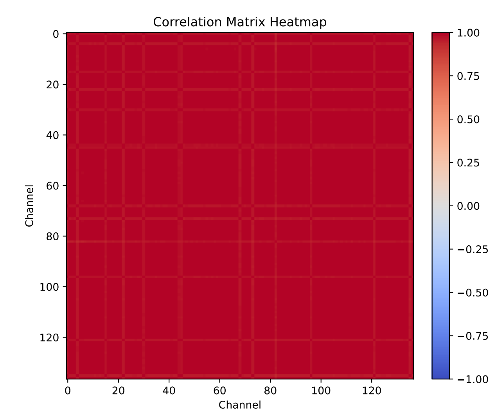

# SimpleTSF
Code release of paper "SimpleTSF: A Simple Yet Effective Method for Multivariate Time Series Forecasting"

## Get Started

1. Install Python 3.8
```
pip install -r requirements.txt
```

2. Data. All benchmark datasets can be obtained from [Google Drive](https://drive.google.com/drive/folders/13Cg1KYOlzM5C7K8gK8NfC-F3EYxkM3D2). All datasets should be placed under folder `./dataset`, such as `./dataset/electricity/electricity.csv`.
3. You can reproduce the experiment results as the following examples
```
# SimpleTSF(P)
sh patch.sh

# SimpleTSF(D)
sh down.sh
```

<p align="center">

<br><br>
</p>
